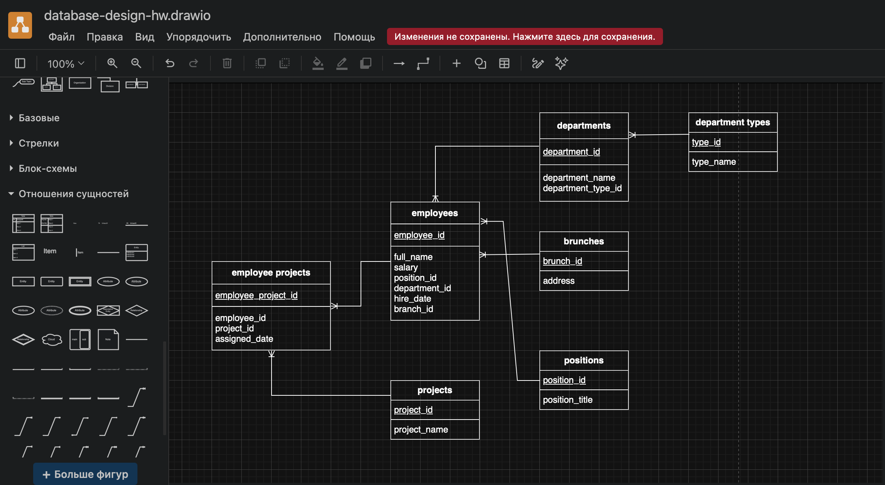
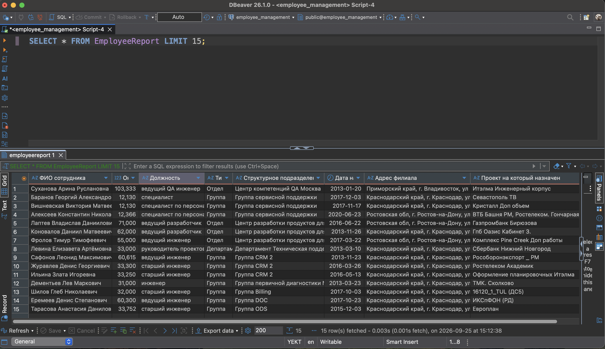

# Schema Design for Employee Management

Проектирование нормализованной схемы базы данных PostgreSQL на основе плоского Excel-отчета по сотрудникам. В ходе работы исходный отчет разбит на 7 связанных таблиц в 3НФ, схема реализована SQL-скриптом с индексами, триггерами, представлением и PL/pgSQL-функцией для загрузки данных.

## Исходные данные

Excel-отчет со столбцами: ФИО, оклад, должность, тип подразделения, структурное подразделение, дата найма, адрес филиала, проект. Данные денормализованы: должности, подразделения, типы подразделений, филиалы и проекты хранились как текст в каждой строке, повторяясь десятки раз.

- Файл отчета: [docs/source-report.xlsx](docs/source-report.xlsx)
- Полная постановка задачи: [task.md](task.md)

## Задача 1. Проектирование схемы БД

**Что требовалось.** Выделить из плоского отчета не менее 7 таблиц, определить для каждой столбцы и типы данных PostgreSQL, назначить первичные ключи, определить связи между таблицами, начертить ER-диаграмму.

**Что сделано.** Выделены 7 таблиц:

| Таблица | Назначение | Ключевые поля |
|---|---|---|
| `Employees` | Сотрудники | `employee_id` PK, `full_name`, `salary`, `hire_date`, `position_id`/`department_id`/`branch_id` FK |
| `Positions` | Справочник должностей | `position_id` PK, `position_title` UNIQUE |
| `Departments` | Структурные подразделения | `department_id` PK, `department_name` UNIQUE, `type_id` FK |
| `DepartmentTypes` | Справочник типов подразделений | `type_id` PK, `type_name` UNIQUE |
| `Branches` | Филиалы | `branch_id` PK, `address` UNIQUE |
| `Projects` | Справочник проектов | `project_id` PK, `project_name` UNIQUE |
| `EmployeeProjects` | Назначения сотрудников на проекты (N:M) | `employee_project_id` PK, UNIQUE(`employee_id`, `project_id`) |

Связи:

- `Employees` → `Positions`, `Departments`, `Branches` — многие-к-одному
- `Departments` → `DepartmentTypes` — многие-к-одному
- `EmployeeProjects` — связующая таблица между `Employees` и `Projects`

ER-диаграмма:



Схема приведена к 3НФ: устранены транзитивные зависимости (`department_name → type_name` вынесено в отдельную таблицу), справочники не дублируются в строках сотрудников.

## Задача 2. Развертывание в PostgreSQL

**Что требовалось.** Развернуть PostgreSQL, описать схему из задачи 1 SQL-скриптом, создать базу данных и выполнить скрипт.

**Что сделано.** Написан скрипт [create-database.sql](create-database.sql):

- Создание 7 таблиц с `SERIAL` первичными ключами.
- Внешние ключи: `ON DELETE RESTRICT` для справочников (нельзя удалить должность или подразделение, пока на них ссылаются сотрудники) и `ON DELETE CASCADE` для связующей `EmployeeProjects`.
- Ограничения: `CHECK (salary > 0)`, `UNIQUE` на естественных ключах справочников (`type_name`, `position_title`, `department_name`, `address`, `project_name`).
- Индексы на всех внешних ключах и на `hire_date`.
- Триггеры на `updated_at` для всех основных таблиц.
- Представление `EmployeeReport` — воспроизводит исходный Excel-отчет, включая список проектов сотрудника через `STRING_AGG`.
- Функция `load_employee_data()` на PL/pgSQL для массовой загрузки сотрудников и назначений.

Запуск:

```bash
createdb employee_management
psql -d employee_management -f create-database.sql
```

Проверка — результат работы представления `EmployeeReport`:



Примеры запросов к получившейся схеме:

```sql
-- Воспроизведение исходного Excel-отчета
SELECT * FROM EmployeeReport;

-- Сотрудники конкретного подразделения
SELECT e.full_name, p.position_title, b.address
FROM Employees e
JOIN Positions p ON e.position_id = p.position_id
JOIN Branches b ON e.branch_id = b.branch_id
WHERE e.department_id = 3;

-- Средний оклад по типу подразделения
SELECT dt.type_name, ROUND(AVG(e.salary), 2) AS avg_salary
FROM Employees e
JOIN Departments d ON e.department_id = d.department_id
JOIN DepartmentTypes dt ON d.type_id = dt.type_id
GROUP BY dt.type_name;
```

## Что освоено

- Нормализация данных: переход от плоского отчета к 7 связанным таблицам в 3НФ.
- Проектирование схемы с учетом ссылочной целостности: `RESTRICT` vs `CASCADE` в зависимости от семантики связи.
- Ограничения `CHECK` и `UNIQUE` для защиты данных на уровне БД.
- Индексирование внешних ключей и полей для выборок по диапазону.
- Триггеры для автоматического обновления метаданных.
- Представления с агрегацией через `STRING_AGG`.
- PL/pgSQL: написание функции массовой загрузки данных.
- Обработка «грязных» данных из источника: числа формата `DDMMYY` в Excel, опечатки в строковых значениях.

## Решения и обоснование

**Обработка исходных данных.** Excel-файл `docs/source-report.xlsx` приведен как есть — это исходные данные от заказчика. Все преобразования (интерпретация дат, исправление опечаток) выполняются на этапе загрузки в SQL-скрипте, чтобы исходник остался нетронутым. Такой подход соответствует практике: сырые данные хранятся отдельно, а их очистка — часть ETL-процесса.

**Формат даты в исходных данных.** Колонка «Дата найма» в Excel содержала целые числа в формате `DDMMYY` без ведущих нулей (например, `200113` = 20.01.2013, `31217` = 03.10.2017). При загрузке все значения приведены к типу `DATE` с явной интерпретацией `DDMMYY`. Это распространенная ловушка при импорте выгрузок из Excel: числовой формат легко принять за `YYMMDD`, что сдвигает даты на годы.

**Исправление опечаток.** В исходных данных встречались опечатки в названиях должностей и подразделений («руководель» → «руководитель», «архектор»/«архектуры» → «архитектор»/«архитектуры»). При загрузке они исправлены для единообразия.

**ON DELETE RESTRICT для справочников.** Должности, подразделения, типы подразделений и филиалы не должны исчезать, пока на них ссылаются сотрудники.

**ON DELETE CASCADE для `EmployeeProjects`.** Связующая таблица без самостоятельной ценности: если сотрудник или проект удален, назначение теряет смысл.

**Индексы.** Внешние ключи проиндексированы, так как используются в JOIN и WHERE. `hire_date` проиндексирован отдельно, поскольку выборки по периоду найма — частый сценарий отчетности.

## Границы решения

Проект решает конкретную задачу — показать нормализацию, работу с ограничениями БД, индексами и представлениями на реальных данных. За рамками оставлены вещи, которые в учебном проекте избыточны, но нужны в продакшене:

- **Миграции** (`goose` / `golang-migrate`) вместо одного скрипта. В учебном проекте один скрипт проще воспроизвести; в реальном проекте нужны версионируемые миграции.
- **Integration-тесты** на чистой БД (`testcontainers`). В учебном проекте схема проверяется вручную; в продакшене ошибки в DDL ловятся до деплоя.
- **Отделение seed-данных от DDL.** Сейчас данные загружаются функцией `load_employee_data()`. В продакшене загрузка выносится в отдельный seed-скрипт или утилиту.

Все перечисленное — известные ограничения учебного формата, а не недоработки.