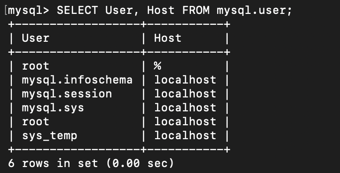
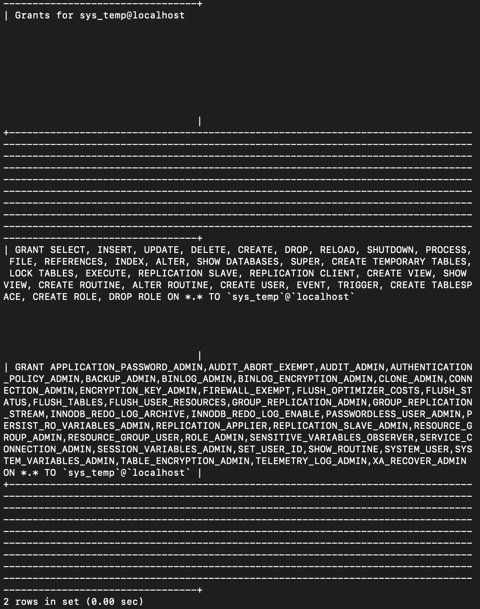
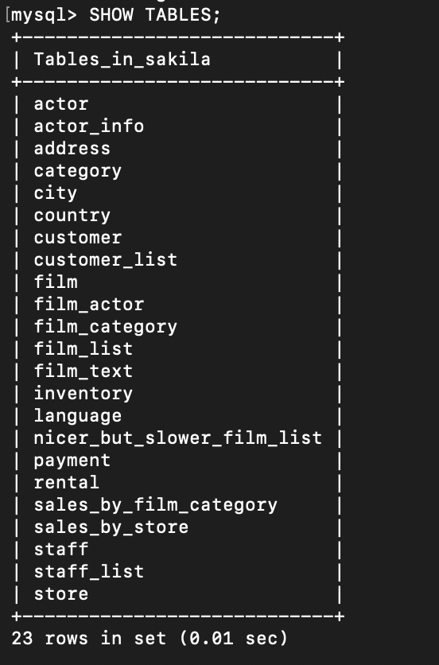
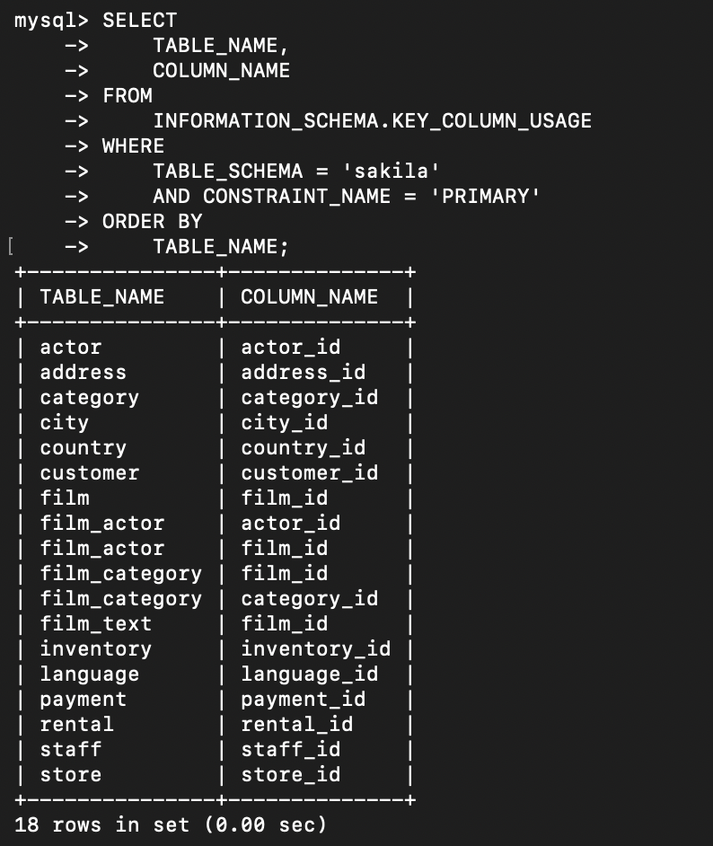
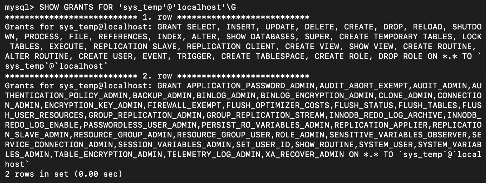

# MySQL Administration: Users, Privileges, Sakila

Развертывание MySQL 8.0 в Docker, создание пользователя `sys_temp`, выдача и отзыв прав, работа с учебной базой sakila и системными таблицами.

## Исходные данные

База sakila — стандартный демо-датасет MySQL (фильмы, актеры, магазины, аренды). Разворачивается из официального дампа `sakila-schema.sql` и `sakila-data.sql`.

Полная постановка задачи — в [task.md](task.md).

## Задача 1. Развертывание MySQL и управление пользователями

**Что требовалось.** Поднять чистый инстанс MySQL 8.0+, создать пользователя `sys_temp`, выдать все права, получить список пользователей и список прав, переподключиться от имени `sys_temp`, восстановить дамп sakila.

**Что сделано.**

Запуск MySQL 8.0 в Docker:

```bash
docker run --name mysql-homework -e MYSQL_ROOT_PASSWORD=root123 -d mysql:8.0
```

Создание пользователя и выдача прав:

```sql
CREATE USER 'sys_temp'@'localhost' IDENTIFIED BY 'password123';
GRANT ALL PRIVILEGES ON *.* TO 'sys_temp'@'localhost';
FLUSH PRIVILEGES;
```

Смена типа аутентификации (для совместимости с клиентом):

```sql
ALTER USER 'sys_temp'@'localhost' IDENTIFIED WITH mysql_native_password BY 'password123';
```

Проверка списка пользователей:

```sql
SELECT User, Host FROM mysql.user;
```

Проверка прав:

```sql
SHOW GRANTS FOR 'sys_temp'@'localhost';
```

Восстановление дампа sakila:

```bash
curl -O https://downloads.mysql.com/docs/sakila-db.zip
unzip sakila-db.zip
docker exec -i mysql-homework mysql -u root -p"root123" < sakila-db/sakila-schema.sql
docker exec -i mysql-homework mysql -u root -p"root123" < sakila-db/sakila-data.sql
```

Результаты на скриншотах:







## Задача 2. Первичные ключи таблиц sakila

**Что требовалось.** Составить таблицу из двух столбцов: название таблицы, название первичного ключа.

**Что сделано.** Первичные ключи получены через системную таблицу `INFORMATION_SCHEMA.KEY_COLUMN_USAGE`:

```sql
SELECT
    TABLE_NAME,
    COLUMN_NAME
FROM
    INFORMATION_SCHEMA.KEY_COLUMN_USAGE
WHERE
    TABLE_SCHEMA = 'sakila'
    AND CONSTRAINT_NAME = 'PRIMARY'
ORDER BY
    TABLE_NAME;
```

Результат:



Представления (views) `actor_info`, `customer_list`, `film_list`, `nicer_but_slower_film_list`, `sales_by_film_category`, `sales_by_store`, `staff_list` не имеют первичных ключей — это виртуальные таблицы, построенные на основе запросов к другим таблицам.

## Задача 3. Отзыв прав на изменение данных

**Что требовалось.** Убрать у пользователя `sys_temp` права на вставку, обновление и удаление данных из базы sakila.

**Что сделано.**

```sql
REVOKE INSERT, UPDATE, DELETE ON sakila.* FROM 'sys_temp'@'localhost';
FLUSH PRIVILEGES;
```

При выполнении получена ошибка:

```
ERROR 1141 (42000): There is no such grant defined for user 'sys_temp' on host 'localhost'
```

Причина — в задаче 1 права были выданы глобально на `*.*`, а не на `sakila.*`. MySQL не позволяет отозвать права выборочно, если они выданы на более высоком уровне.

Проверка прав после попытки отзыва:

```sql
SHOW GRANTS FOR 'sys_temp'@'localhost'\G
```

Результат на скриншоте:



### Что можно было бы сделать иначе

Если бы права изначально выдавались только на `sakila.*`, задание решалось бы в одну команду:

```sql
GRANT ALL PRIVILEGES ON sakila.* TO 'sys_temp'@'localhost';
-- ...
REVOKE INSERT, UPDATE, DELETE ON sakila.* FROM 'sys_temp'@'localhost';
```

Это более корректный подход с точки зрения принципа наименьших привилегий: пользователь получает права только на нужную базу, а не на весь сервер.

## Что освоено

- Развертывание MySQL 8.0 в Docker.
- Создание пользователей и управление правами (`CREATE USER`, `GRANT`, `REVOKE`, `FLUSH PRIVILEGES`).
- Работа с `INFORMATION_SCHEMA` для получения метаданных.
- Восстановление БД из официального дампа.
- Понимание уровней привилегий в MySQL (глобальные vs на уровне БД) и почему `REVOKE` не всегда работает так, как ожидается.

## Границы решения

- Развертывание через `docker run` без `docker-compose.yml`. Для одного контейнера этого достаточно; при добавлении сервисов (например, реплик) понадобится compose.
- Секреты (`root123`, `password123`) записаны в открытом виде прямо в командах. Для учебного примера это нормально; в продакшене используется `.env` или Docker secrets.
- Автоматических тестов нет — задание проверяется вручную через `SHOW GRANTS` и скриншоты.