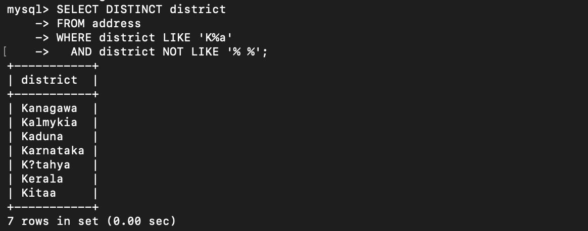
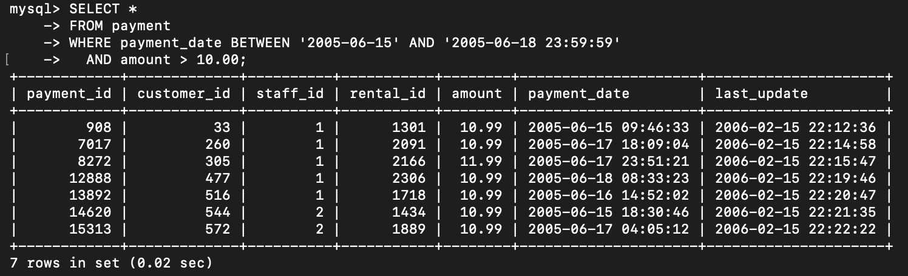
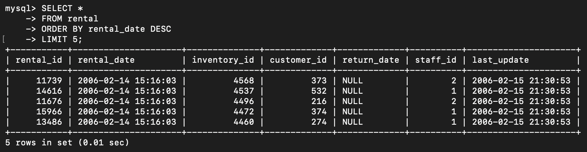
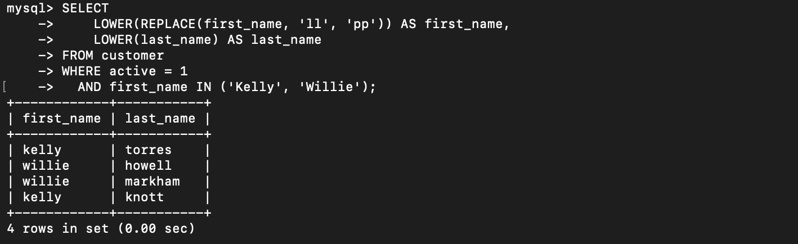
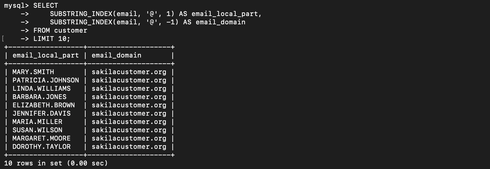
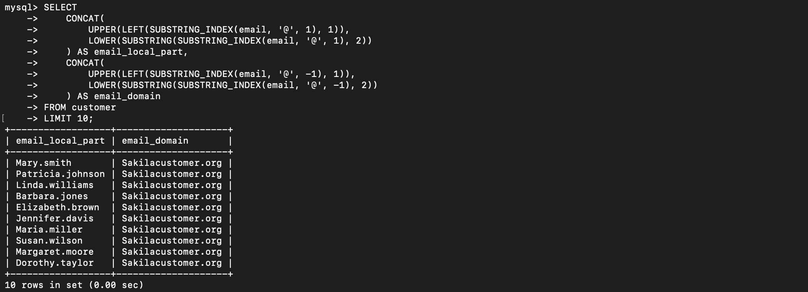

# SQL Basics: SELECT, Filtering, String Functions

Практика базовых SQL-запросов на MySQL и базе sakila: выборка, фильтрация, сортировка, ограничение строк и строковые функции.

## Исходные данные

База sakila — стандартный демо-датасет MySQL. Используемые таблицы: `address`, `payment`, `rental`, `customer`.

Полная постановка задачи — в [task.md](task.md).

## Задача 1. Фильтрация по шаблону

**Что требовалось.** Получить уникальные названия районов, которые начинаются на «K», заканчиваются на «a» и не содержат пробелов.

**Запрос.**

```sql
SELECT DISTINCT district
FROM address
WHERE district LIKE 'K%a'
  AND district NOT LIKE '% %';
```

**Разбор.** `LIKE 'K%a'` — шаблон с началом и концом, `%` соответствует любой подстроке. `NOT LIKE '% %'` исключает значения с пробелами внутри. `DISTINCT` убирает дубликаты, так как один и тот же район может встречаться в нескольких адресах.

**Результат:**



## Задача 2. Фильтрация по диапазону

**Что требовалось.** Получить платежи за период с 15 по 18 июня 2005 года включительно, сумма которых больше 10.00.

**Запрос.**

```sql
SELECT *
FROM payment
WHERE payment_date BETWEEN '2005-06-15' AND '2005-06-18 23:59:59'
  AND amount > 10.00
LIMIT 10;
```

**Разбор.** `BETWEEN` включает обе границы. Так как поле `payment_date` содержит и дату, и время, для «включительно по 18 июня» верхняя граница задана как `'2005-06-18 23:59:59'`. Альтернатива — использовать `payment_date >= '2005-06-15' AND payment_date < '2005-06-19'`, что исключает ловушку с конечной секундой дня. `LIMIT 10` добавлен для скриншота — в реальном запросе его быть не должно.

**Результат:**



## Задача 3. Сортировка и LIMIT

**Что требовалось.** Получить последние пять аренд фильмов.

**Запрос.**

```sql
SELECT *
FROM rental
ORDER BY rental_date DESC
LIMIT 5;
```

**Разбор.** `ORDER BY rental_date DESC` сортирует от новых к старым, `LIMIT 5` оставляет первые пять строк — самые свежие аренды.

**Результат:**



## Задача 4. Строковые функции

**Что требовалось.** Получить активных покупателей с именами Kelly или Willie, привести все буквы к нижнему регистру и заменить `ll` на `pp`.

**Запрос.**

```sql
SELECT
    LOWER(REPLACE(first_name, 'll', 'pp')) AS first_name,
    LOWER(last_name) AS last_name
FROM customer
WHERE active = 1
  AND first_name IN ('Kelly', 'Willie');
```

**Разбор.** `REPLACE(first_name, 'll', 'pp')` меняет подстроку до приведения регистра, чтобы не потерять строчные `ll` после `LOWER`. `IN ('Kelly', 'Willie')` — короткая замена двух `OR`. Условие `active = 1` фильтрует только активных клиентов.

**Результат:**



## Задача 5*. Разделение email на две колонки

**Что требовалось.** Разделить email каждого покупателя на две колонки: часть до `@` и часть после.

**Запрос.**

```sql
SELECT
    SUBSTRING_INDEX(email, '@', 1) AS email_local_part,
    SUBSTRING_INDEX(email, '@', -1) AS email_domain
FROM customer
LIMIT 10;
```

**Разбор.** `SUBSTRING_INDEX(str, delim, n)` возвращает подстроку до `n`-го вхождения разделителя. Если `n` положительное — отсчет слева, если отрицательное — справа. `1` дает локальную часть, `-1` — домен.

**Результат:**



## Задача 6*. Капитализация частей email

**Что требовалось.** Доработать предыдущий запрос: первая буква заглавная, остальные строчные — в обеих частях.

**Запрос.**

```sql
SELECT
    CONCAT(
        UPPER(LEFT(SUBSTRING_INDEX(email, '@', 1), 1)),
        LOWER(SUBSTRING(SUBSTRING_INDEX(email, '@', 1), 2))
    ) AS email_local_part,
    CONCAT(
        UPPER(LEFT(SUBSTRING_INDEX(email, '@', -1), 1)),
        LOWER(SUBSTRING(SUBSTRING_INDEX(email, '@', -1), 2))
    ) AS email_domain
FROM customer
LIMIT 10;
```

**Разбор.** Для каждой части email:

- `LEFT(x, 1)` берет первый символ, `UPPER` приводит его к верхнему регистру.
- `SUBSTRING(x, 2)` берет все символы начиная со второго, `LOWER` приводит их к нижнему регистру.
- `CONCAT` склеивает получившиеся части.

**Результат:**



## Что освоено

- Фильтрация через `LIKE` с шаблонами `%` и отрицанием через `NOT LIKE`.
- `BETWEEN` для диапазонных условий и тонкость работы с датами и временем.
- Сортировка `ORDER BY` и ограничение `LIMIT`.
- Комбинирование строковых функций: `LOWER`, `UPPER`, `REPLACE`, `SUBSTRING_INDEX`, `LEFT`, `SUBSTRING`, `CONCAT`.
- Подстановка альтернатив через `IN` вместо цепочки `OR`.

## Границы решения

- Все запросы выполняются в командной строке или IDE без автоматизации. В реальном проекте такие вещи проверяются тестами или выносятся в миграции/представления.
- `BETWEEN ... AND '2005-06-18 23:59:59'` — рабочее решение, но в проде надежнее использовать полуоткрытый интервал `>= AND <` на следующий день, чтобы не зависеть от последней секунды дня.
- `LIMIT 10` в задачах 2, 5 и 6 добавлен только для читаемости скриншотов. В реальных запросах без ограничения выборки он не нужен.