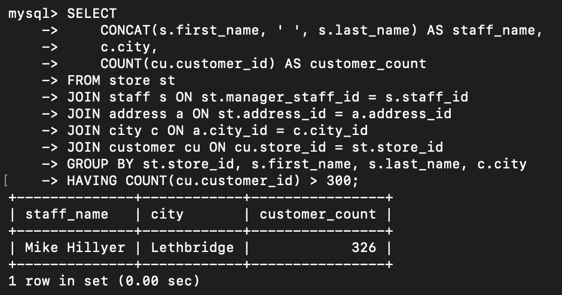
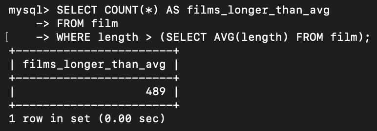
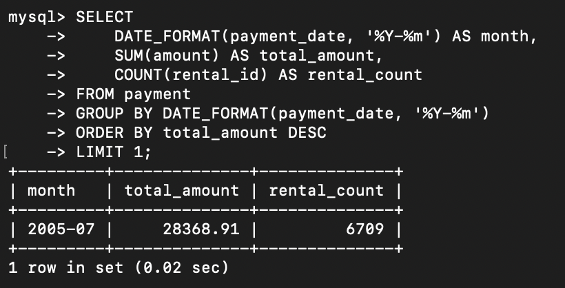
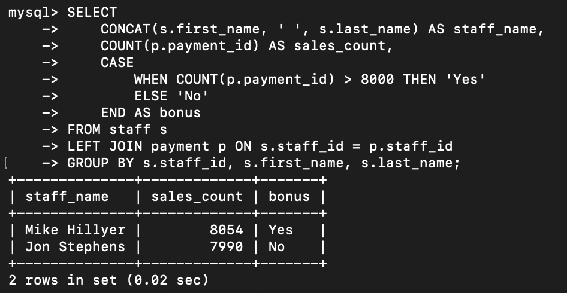
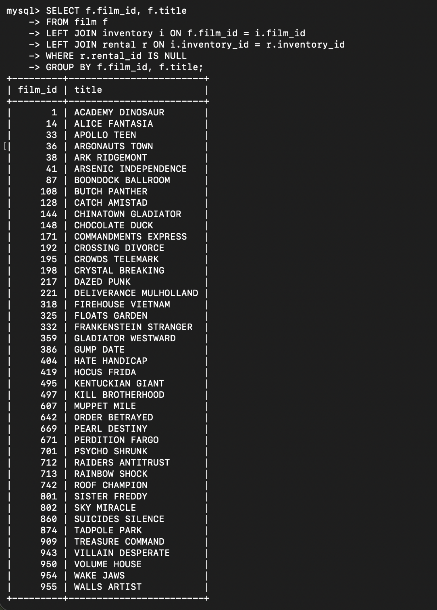

# SQL Joins and Aggregation

Практика многотабличных JOIN, агрегации и подзапросов на MySQL и базе sakila.

## Исходные данные

База sakila — стандартный демо-датасет MySQL. Используемые таблицы: `store`, `staff`, `address`, `city`, `customer`, `film`, `inventory`, `rental`, `payment`.

Полная постановка задачи — в [task.md](task.md).

## Задача 1. Многотабличный JOIN с HAVING

**Что требовалось.** Получить магазин, в котором более 300 покупателей: имя сотрудника, город магазина, количество покупателей.

**Запрос.**

```sql
SELECT
    CONCAT(s.first_name, ' ', s.last_name) AS staff_name,
    c.city,
    COUNT(cu.customer_id) AS customer_count
FROM store st
JOIN staff s ON st.manager_staff_id = s.staff_id
JOIN address a ON st.address_id = a.address_id
JOIN city c ON a.city_id = c.city_id
JOIN customer cu ON cu.store_id = st.store_id
GROUP BY st.store_id, s.first_name, s.last_name, c.city
HAVING COUNT(cu.customer_id) > 300;
```

**Разбор.** Пять таблиц соединяются по цепочке: `store → staff` (по `manager_staff_id`), `store → address → city` (адрес и город магазина), `store → customer` (покупатели магазина). `GROUP BY` группирует по магазину и сотруднику, `COUNT` считает покупателей, `HAVING` фильтрует группы с числом покупателей больше 300.

**Результат:**



## Задача 2. Подзапрос

**Что требовалось.** Получить количество фильмов, продолжительность которых больше средней по всем фильмам.

**Запрос.**

```sql
SELECT COUNT(*) AS films_longer_than_avg
FROM film
WHERE length > (SELECT AVG(length) FROM film);
```

**Разбор.** Подзапрос `(SELECT AVG(length) FROM film)` вычисляет среднюю продолжительность, внешний запрос считает фильмы, у которых `length` больше этого значения. Подзапрос выполняется один раз.

**Результат:**



## Задача 3. Агрегация с группировкой по месяцу

**Что требовалось.** Получить месяц с наибольшей суммой платежей и количество аренд за этот месяц.

**Запрос.**

```sql
SELECT
    DATE_FORMAT(payment_date, '%Y-%m') AS month,
    SUM(amount) AS total_amount,
    COUNT(rental_id) AS rental_count
FROM payment
GROUP BY DATE_FORMAT(payment_date, '%Y-%m')
ORDER BY total_amount DESC
LIMIT 1;
```

**Разбор.** `DATE_FORMAT(payment_date, '%Y-%m')` группирует платежи по месяцам. `SUM(amount)` — сумма платежей за месяц, `COUNT(rental_id)` — количество аренд. `ORDER BY total_amount DESC LIMIT 1` оставляет месяц с максимальной суммой.

**Результат:**



## Задача 4*. CASE для вычисляемой колонки

**Что требовалось.** Посчитать количество продаж по каждому продавцу и добавить колонку «Премия»: «Да», если больше 8000 продаж, иначе «Нет».

**Запрос.**

```sql
SELECT
    CONCAT(s.first_name, ' ', s.last_name) AS staff_name,
    COUNT(p.payment_id) AS sales_count,
    CASE
        WHEN COUNT(p.payment_id) > 8000 THEN 'Yes'
        ELSE 'No'
    END AS bonus
FROM staff s
LEFT JOIN payment p ON s.staff_id = p.staff_id
GROUP BY s.staff_id, s.first_name, s.last_name;
```

**Разбор.** `LEFT JOIN` сохраняет продавцов даже без продаж (в sakila таких нет, но в реальных данных бывает). `CASE WHEN ... THEN ... ELSE ... END` создает вычисляемую колонку `bonus`. `GROUP BY s.staff_id` — по продавцу.

**Результат:**



## Задача 5*. Поиск записей без связанных данных

**Что требовалось.** Найти фильмы, которые ни разу не брали в аренду.

**Запрос.**

```sql
SELECT f.film_id, f.title
FROM film f
LEFT JOIN inventory i ON f.film_id = i.film_id
LEFT JOIN rental r ON i.inventory_id = r.inventory_id
WHERE r.rental_id IS NULL
GROUP BY f.film_id, f.title;
```

**Разбор.** Два `LEFT JOIN` подряд: фильм → инвентарь → аренды. Если фильм никогда не арендовали, в `rental` не будет связанных строк, и `r.rental_id` окажется `NULL`. `WHERE r.rental_id IS NULL` оставляет только такие фильмы. `GROUP BY` убирает дубликаты — один фильм может быть в нескольких копиях инвентаря.

**Результат:**



## Что освоено

- Многотабличные `JOIN` (5 таблиц в одном запросе).
- `LEFT JOIN` для сохранения строк без совпадений.
- Агрегация: `COUNT`, `SUM`, `AVG`.
- `GROUP BY` и `HAVING` — фильтрация групп после агрегации.
- Подзапросы в `WHERE`.
- Вычисляемые колонки через `CASE`.
- Паттерн «анти-join»: `LEFT JOIN ... WHERE ... IS NULL` для поиска записей без связанных строк.
- Функции работы с датами: `DATE_FORMAT`.

## Границы решения

- В задаче 3 использован `LIMIT 1` для выбора месяца с максимальной суммой. Это работает, если суммы по месяцам уникальны. Если два месяца дали одинаковую сумму, вернется только один. Более надежный вариант — `WHERE total_amount = (SELECT MAX(...))`, но для sakila это не критично.
- В задаче 5 `GROUP BY f.film_id, f.title` формально избыточен: `LEFT JOIN ... IS NULL` уже дает уникальные `film_id`. Оставлен для явности.
- Все запросы выполняются вручную, без автоматизации.