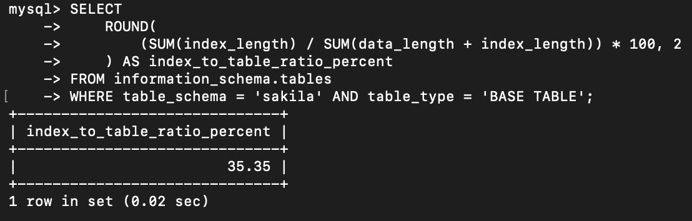
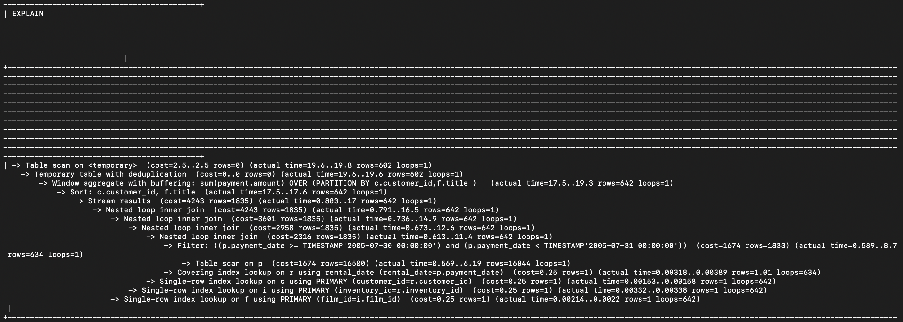

# SQL Optimization: EXPLAIN ANALYZE and Indexes

Анализ производительности SQL-запросов на PostgreSQL: работа с EXPLAIN ANALYZE, выявление узких мест, оптимизация запросов, обзор типов индексов PostgreSQL vs MySQL.

## Исходные данные

Задание выполняется на учебной базе данных sakila, развернутой в PostgreSQL. Используемые таблицы: `payment`, `rental`, `customer`, `inventory`, `film`.

Полная постановка задачи — в [task.md](task.md).

## Задача 1. Процентное отношение размера индексов к размеру таблиц

**Что требовалось.** Написать запрос к учебной базе данных, возвращающий процентное отношение общего размера всех индексов к общему размеру всех таблиц.

**Запрос.**

```sql
SELECT
    ROUND(
        (SUM(index_length) / SUM(data_length + index_length)) * 100,
        2
    ) AS index_to_table_ratio_percent
FROM information_schema.tables
WHERE table_schema = 'sakila' AND table_type = 'BASE TABLE';
```

**Разбор.** `information_schema.tables` содержит метаданные обо всех таблицах: `data_length` — размер данных, `index_length` — размер индексов. `ROUND(..., 2)` округляет результат до двух знаков. Фильтр `table_type = 'BASE TABLE'` исключает представления, у которых этих полей нет.

**Результат:**



## Задача 2. EXPLAIN ANALYZE и оптимизация

**Что требовалось.** Выполнить EXPLAIN ANALYZE для заданного запроса, перечислить узкие места, оптимизировать запрос и добавить индексы при необходимости.

**Исходный запрос.**

```sql
SELECT DISTINCT
    CONCAT(c.last_name, ' ', c.first_name),
    SUM(p.amount) OVER (PARTITION BY c.customer_id, f.title)
FROM payment p, rental r, customer c, inventory i, film f
WHERE DATE(p.payment_date) = '2005-07-30'
  AND p.payment_date = r.rental_date
  AND r.customer_id = c.customer_id
  AND i.inventory_id = r.inventory_id;
```

**Узкие места.**

1. `DATE(p.payment_date) = '2005-07-30'` — применение функции к индексированному полю делает индекс бесполезным. Планировщик не может использовать индекс по `payment_date`, потому что сравнивает не само поле, а результат функции.
2. Отсутствие индекса на `payment_date` — фильтр по дате не оптимизирован.
3. Устаревший синтаксис JOIN через запятую (неявные соединения) — читается хуже, чем явный `INNER JOIN`.
4. Оконная функция `SUM(...) OVER (PARTITION BY c.customer_id, f.title)` без поддержки индексами — сортировка и группировка выполняются в памяти.
5. Соединение `p.payment_date = r.rental_date` — не по индексированному ключу, а по датам, что медленнее, чем связь по `rental_id`.
6. `DISTINCT` после `OVER` может быть избыточным в зависимости от данных.

**Оптимизированный запрос.**

```sql
SELECT DISTINCT
    CONCAT(c.last_name, ' ', c.first_name),
    SUM(p.amount) OVER (PARTITION BY c.customer_id, f.title)
FROM payment p
JOIN rental r ON p.rental_id = r.rental_id
JOIN customer c ON r.customer_id = c.customer_id
JOIN inventory i ON r.inventory_id = i.inventory_id
JOIN film f ON i.film_id = f.film_id
WHERE p.payment_date >= '2005-07-30'
  AND p.payment_date < '2005-07-31';
```

**Что изменилось.**

- `DATE(p.payment_date) = '2005-07-30'` заменено на диапазон `>= AND <`. Индекс по `payment_date` теперь может использоваться.
- Неявные соединения заменены на явные `JOIN ... ON`.
- Соединение `p.payment_date = r.rental_date` заменено на `p.rental_id = r.rental_id` — по первичному ключу, что быстрее.

**Рекомендуемые индексы.**

```sql
CREATE INDEX idx_payment_date ON payment(payment_date);
CREATE INDEX idx_payment_rental_amount ON payment(rental_id, amount);
```

`idx_payment_date` ускоряет фильтрацию по дате, `idx_payment_rental_amount` — покрывающий индекс для соединения и агрегации.

**Результат после оптимизации:**



## Задача 3*. Типы индексов PostgreSQL, отсутствующие в MySQL

**Что требовалось.** Изучить типы индексов PostgreSQL и перечислить те, которых нет в MySQL.

**Ответ.**

| Тип индекса | Назначение | Использование в PostgreSQL |
|---|---|---|
| **GiST** (Generalized Search Tree) | Инфраструктура для различных стратегий индексирования, включая R-tree | Геометрические и пространственные данные, поиск ближайшего соседа |
| **SP-GiST** (Space-Partitioned GiST) | Поддержка небалансированных дисковых структур (quadtree, k-d tree, radix tree) | Данные с неравномерным распределением, геопространственные запросы |
| **GIN** (Generalized Inverted Index) | Инвертированный индекс для составных значений | JSONB, массивы, полнотекстовый поиск |
| **BRIN** (Block Range Index) | Хранит сводки по диапазонам блоков | Очень большие таблицы с естественной упорядоченностью данных |
| **Partial Index** | Индекс только на подмножество строк | Ускорение запросов к часто используемым подмножествам данных |

**Дополнительные различия:**

1. **Функциональные индексы** — PostgreSQL поддерживает индексы на основе выражений (например, `CREATE INDEX ON users (LOWER(email))`). В MySQL функциональные индексы появились только в 8.0.13+, до этого их не было.
2. **Hash-индексы** — в PostgreSQL полноценно поддерживаются с WAL-логированием. В MySQL hash-индексы есть только в MEMORY-движке или как Adaptive Hash Index внутри InnoDB.
3. **Bitmap-индексы** — в PostgreSQL планировщик автоматически строит Bitmap Index Scan для комбинирования нескольких индексов. В MySQL встроенной поддержки bitmap-индексов нет.
4. **Индексы на массивах и JSONB** — в PostgreSQL можно индексировать массивы и JSONB-поля через GIN. В MySQL JSON-поля индексируются только через генерируемые колонки.

## Что освоено

- Работа с `information_schema` для получения метаданных о размерах таблиц и индексов.
- Чтение плана запроса через `EXPLAIN ANALYZE`.
- Выявление узких мест: функции на индексированных полях, отсутствующие индексы, неявные соединения, неоптимальные условия JOIN.
- Оптимизация запроса: замена функции на диапазон для использования индекса, явные `JOIN`, соединение по первичному ключу.
- Создание индексов под конкретный запрос (фильтрация + покрывающий индекс).
- Понимание различий между типами индексов в PostgreSQL и MySQL (GiST, GIN, BRIN, SP-GiST, partial indexes).

## Границы решения

- Задание выполняется на sakila — небольшом демо-датасете. На реальных объемах данных эффект от оптимизации был бы заметнее. `EXPLAIN ANALYZE` на малой таблице может показывать cost, который не соответствует production-нагрузке.
- Индексы `idx_payment_date` и `idx_payment_rental_amount` создаются без учета write-нагрузки. В реальной системе каждый лишний индекс замедляет `INSERT`/`UPDATE`, поэтому индексы добавляются осознанно под конкретные запросы.
- Кэш и настройки PostgreSQL (например, `work_mem`) могут влиять на план запроса. В учебном задании они не тюнились.