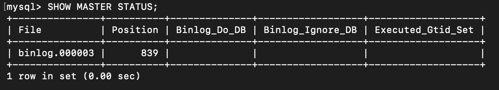
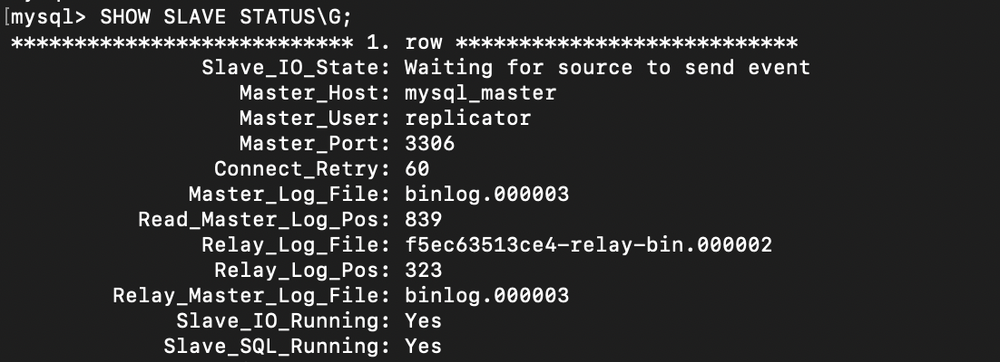
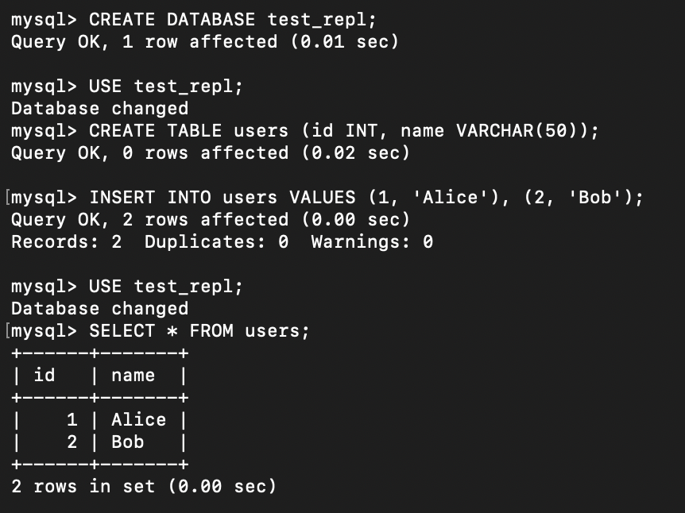
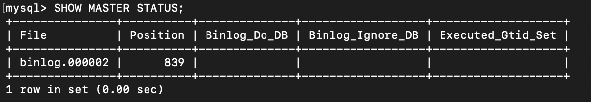
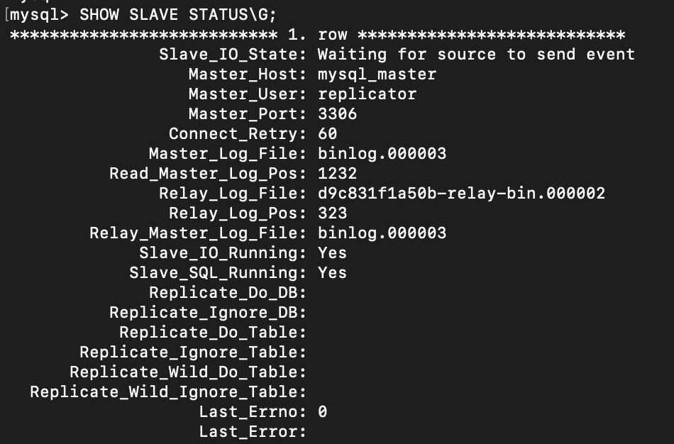
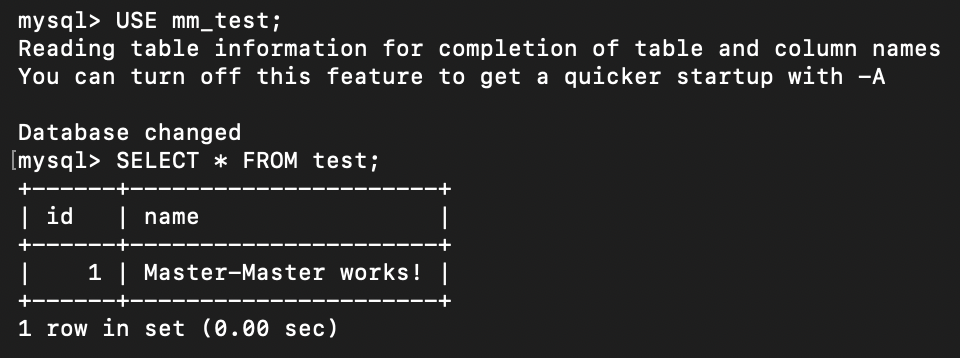

# MySQL Replication: Master-Slave and Master-Master

Настройка репликации MySQL 8.0 в Docker: однонаправленная Master-Slave и двунаправленная Master-Master. Проверка через SHOW MASTER STATUS, SHOW SLAVE STATUS и тестовые данные.

## Исходные данные

Два (для Master-Master — три) контейнера MySQL 8.0 в Docker. Конфигурация через binlog-репликацию, без использования сторонних инструментов вроде Orchestrator или MHA.

Полная постановка задачи — в [task.md](task.md).

## Задача 1. Различия режимов репликации

**Что требовалось.** Описать различия между Master-Slave и Master-Master репликацией.

**Ответ.**

| Характеристика | Master-Slave | Master-Master |
|---|---|---|
| Направление репликации | Однонаправленная (Master → Slave) | Двунаправленная (Master ↔ Master) |
| Запись | Только на мастер | На оба сервера |
| Чтение | С мастера или со слейва | С любого сервера |
| Количество мастеров | 1 | 2 и более |
| Отказоустойчивость | При падении мастера — ручной или автоматический промоушен слейва | При падении одного — второй продолжает работу |
| Сложность настройки | Низкая | Высокая |
| Риск конфликтов | Отсутствует | Высокий (требуется разрешение) |
| Пример использования | OLTP, отказоустойчивость | Геораспределение, высокий uptime |

**Ключевое различие.** Master-Slave — репликация в одну сторону, слейв только читает. Master-Master — двусторонняя, оба сервера пишут, и записи реплицируются друг к другу. Это дает отказоустойчивость, но создает риск конфликтов при одновременной записи одних и тех же данных на оба сервера.

## Задача 2. Master-Slave репликация

**Что требовалось.** Настроить Master-Slave репликацию, приложить скриншоты состояния серверов.

**Что сделано.**

Запуск двух контейнеров MySQL 8.0:

```bash
docker run --name mysql_master -p 3306:3306 -e MYSQL_ROOT_PASSWORD=12345 -d mysql:8.0
docker run --name mysql_slave -p 3307:3306 -e MYSQL_ROOT_PASSWORD=12345 -d mysql:8.0
```

Создание сети и подключение контейнеров:

```bash
docker network create mysql-net
docker network connect mysql-net mysql_master
docker network connect mysql-net mysql_slave
```

**Настройка мастера.**

```sql
CREATE USER 'replicator'@'%' IDENTIFIED WITH mysql_native_password BY 'replica_pass';
GRANT REPLICATION SLAVE ON *.* TO 'replicator'@'%';
FLUSH PRIVILEGES;

SHOW MASTER STATUS;
```



**Настройка слейва.**

```sql
STOP SLAVE;

CHANGE MASTER TO
  MASTER_HOST = 'mysql_master',
  MASTER_USER = 'replicator',
  MASTER_PASSWORD = 'replica_pass',
  MASTER_PORT = 3306,
  MASTER_LOG_FILE = 'binlog.000003',
  MASTER_LOG_POS = 839;

START SLAVE;
SHOW SLAVE STATUS\G;
```



В выводе `SHOW SLAVE STATUS` ключевые поля:

- `Slave_IO_Running: Yes` — поток чтения binlog с мастера работает.
- `Slave_SQL_Running: Yes` — поток применения изменений работает.
- `Last_Errno: 0` — ошибок нет.

**Проверка репликации.**

```sql
-- на мастере
CREATE DATABASE test_repl;
USE test_repl;
CREATE TABLE users (id INT, name VARCHAR(50));
INSERT INTO users VALUES (1, 'Alice'), (2, 'Bob');

-- на слейве
USE test_repl;
SELECT * FROM users;
```



## Задача 3*. Master-Master репликация

**Что требовалось.** Настроить Master-Master репликацию, проверить работу.

**Что сделано.**

Запуск второго мастера:

```bash
docker run --name mysql_master2 -p 3308:3306 -e MYSQL_ROOT_PASSWORD=12345 -d mysql:8.0
docker network connect mysql-net mysql_master2
```

Создание пользователя для репликации на втором мастере (у каждого контейнера своя таблица `mysql.user`, поэтому пользователь создается заново):

```sql
CREATE USER 'replicator'@'%' IDENTIFIED WITH mysql_native_password BY 'replica_pass';
GRANT REPLICATION SLAVE ON *.* TO 'replicator'@'%';
FLUSH PRIVILEGES;

SHOW MASTER STATUS;
```



**Настройка двунаправленной репликации.**

```sql
-- на mysql_master: репликация с master2
STOP SLAVE;
CHANGE MASTER TO
  MASTER_HOST = 'mysql_master2',
  MASTER_USER = 'replicator',
  MASTER_PASSWORD = 'replica_pass',
  MASTER_PORT = 3306,
  MASTER_LOG_FILE = 'binlog.000002',
  MASTER_LOG_POS = 839;
START SLAVE;

-- на mysql_master2: репликация с master
STOP SLAVE;
CHANGE MASTER TO
  MASTER_HOST = 'mysql_master',
  MASTER_USER = 'replicator',
  MASTER_PASSWORD = 'replica_pass',
  MASTER_PORT = 3306,
  MASTER_LOG_FILE = 'binlog.000003',
  MASTER_LOG_POS = 1232;
START SLAVE;

SHOW SLAVE STATUS\G;
```



**Проверка Master-Master.** Создаем данные на первом мастере, читаем на втором.

```sql
-- на mysql_master
CREATE DATABASE mm_test;
USE mm_test;
CREATE TABLE test (id INT, name VARCHAR(50));
INSERT INTO test VALUES (1, 'Master-Master works!');

-- на mysql_master2
USE mm_test;
SELECT * FROM test;
```



## Что освоено

- Развертывание нескольких контейнеров MySQL 8.0 в Docker и объединение их в сеть.
- Настройка binlog-репликации: создание пользователя `replicator`, `CHANGE MASTER TO`, `START SLAVE`.
- Чтение `SHOW MASTER STATUS` и `SHOW SLAVE STATUS` — ключевые поля для диагностики (`Slave_IO_Running`, `Slave_SQL_Running`, `Last_Errno`).
- Отличие однонаправленной и двунаправленной репликации.
- Понимание, что у каждого контейнера MySQL своя таблица `mysql.user`, поэтому пользователь для репликации создается на каждом узле отдельно.
- Проверка репликации через создание данных на источнике и чтение на приемнике.

## Границы решения

- Настройка без явного `server-id` в `my.cnf`. В официальном образе MySQL 8.0 параметр по умолчанию равен 1, что для Master-Master с двумя серверами формально неверно: `server-id` должен быть уникальным. В учебной конфигурации это не помешало работе, но в продакшене `server-id` задается явно.
- Команды репликации приведены в «классическом» синтаксисе (`CHANGE MASTER TO`, `SHOW MASTER STATUS`, `SHOW SLAVE STATUS`). В MySQL 8.0.23+ они объявлены устаревшими и заменены на `CHANGE REPLICATION SOURCE TO`, `SHOW BINARY LOG STATUS`, `SHOW REPLICA STATUS`; старый синтаксис продолжает работать, но выводит warning.
- Нет автоматического failover. Если мастер упадет, слейв не станет мастером сам — это делается вручную или через Orchestrator/MHA.
- Позиции binlog (`MASTER_LOG_POS`) актуальны на момент выполнения. После перезапуска контейнера их надо получать заново через `SHOW MASTER STATUS`.
- Секреты (`12345`, `replica_pass`) записаны в открытом виде. Для учебного задания это нормально; в продакшене — `.env` или Docker secrets.