# Sharding: Vertical and Horizontal

Планирование и настройка шардинга базы данных MySQL. Вертикальное разделение по столбцам и горизонтальное по строкам, разбор преимуществ разных методов масштабирования, реализация на Docker.

## Исходные данные

Учебный сценарий: база данных из трех таблиц — `users`, `books`, `stores`. Задача — распределить данные между несколькими серверами двумя способами: вертикальным (по столбцам) и горизонтальным (по строкам).

Полная постановка задачи — в [task.md](task.md).

## Задача 1. Преимущества методов масштабирования

**Что требовалось.** Описать преимущества четырех методов масштабирования: master-slave с пассивным слейвом, master + несколько слейвов, DRBD, SAN-кластер.

**Ответ.**

### Активный master и пассивный slave

| Преимущество | Описание |
|---|---|
| Отказоустойчивость | При падении мастера слейв может быть быстро переключен в мастер |
| Разгрузка мастера | Запросы на чтение можно направлять на слейв |
| Резервное копирование | Бэкап снимается со слейва, не нагружая мастер |
| Простота настройки | Минимальная конфигурация для отказоустойчивости |
| Аналитика и отчеты | Слейв можно использовать для аналитических запросов |

### Master и несколько slave

| Преимущество | Описание |
|---|---|
| Горизонтальное масштабирование чтения | Нагрузка распределяется между слейвами |
| Геораспределение | Слейвы в разных регионах снижают задержки для пользователей |
| Специализация | Разные слейвы под разные задачи (аналитика, бэкапы, отчеты) |
| Балансировка нагрузки | Новые слейвы добавляются без остановки системы |
| Высокая доступность | При падении одного слейва остальные продолжают работать |

### DRBD (Distributed Replicated Block Device)

| Преимущество | Описание |
|---|---|
| Репликация на уровне блока | Работает с любой файловой системой и любой СУБД |
| Синхронная репликация | Данные записываются на оба узла до подтверждения транзакции |
| Прозрачность для приложений | СУБД не знает, что работает поверх DRBD |
| Быстрое переключение | При отказе активного узла пассивный становится активным |
| Простота конфигурации | Не требует изменений в приложении или СУБД |

### SAN-кластер

| Преимущество | Описание |
|---|---|
| Общее хранилище | Все узлы кластера имеют доступ к одним данным |
| Нет дублирования данных | Данные хранятся один раз, репликация на уровне SAN |
| Высокая производительность | Специализированное оборудование и выделенная сеть |
| Масштабируемость | Добавление новых узлов для чтения без дублирования данных |
| Централизованное управление | Бэкапы и снапшоты на уровне хранилища |

## Задача 2. План шардинга

**Что требовалось.** Разработать план горизонтального и вертикального шардинга для трех таблиц. Начертить блок-схему, описать режимы работы серверов.

**Что сделано.**

### Вертикальный шардинг (разделение по столбцам)

Каждая таблица разрезается на две части. Данные выносятся на отдельные серверы.

**Таблица `users`:**

| Сервер 1 — `users_base` | Сервер 2 — `users_auth` |
|---|---|
| `user_id` (PK) | `user_id` (PK) |
| `username` | `password_hash` |
| `email` | `last_login` |
| `created_at` | |

**Таблица `books`:**

| Сервер 3 — `books_info` | Сервер 4 — `books_inventory` |
|---|---|
| `book_id` (PK) | `book_id` (PK) |
| `title` | `price` |
| `author` | `stock` |
| `genre` | |

**Таблица `stores`:**

| Сервер 5 — `stores_contacts` | Сервер 6 — `stores_management` |
|---|---|
| `store_id` (PK) | `store_id` (PK) |
| `store_name` | `phone` |
| `address` | `working_hours` |
| | `manager_id` |

`user_id` в `users_auth` (аналогично для books и stores) логически связан с соответствующей таблицей на другом сервере, но не является внешним ключом — СУБД не поддерживает FK между разными физическими серверами. Целостность обеспечивается на уровне приложения.

### Горизонтальный шардинг (разделение по строкам)

Данные одной таблицы распределяются по нескольким серверам по ключу шардирования.

**Таблица `users` (по диапазону `user_id`):**

| Шард | Диапазон | Сервер | Режим |
|---|---|---|---|
| Shard_1 | 1–1000 | `db_users_shard1` | Read-Write |
| Shard_2 | 1001–2000 | `db_users_shard2` | Read-Write |
| Shard_3 | 2001–3000 | `db_users_shard3` | Read-Write |

**Таблица `books` (по жанру):**

| Шард | Жанр | Сервер | Режим |
|---|---|---|---|
| Shard_1 | Фантастика, фэнтези | `db_books_shard1` | Read-Write |
| Shard_2 | Детективы, триллеры | `db_books_shard2` | Read-Write |
| Shard_3 | Романы, проза | `db_books_shard3` | Read-Write |

**Таблица `stores` (по региону):**

| Шард | Регион | Сервер | Режим |
|---|---|---|---|
| Shard_1 | Москва и область | `db_stores_shard1` | Read-Write |
| Shard_2 | Санкт-Петербург | `db_stores_shard2` | Read-Write |
| Shard_3 | Другие регионы | `db_stores_shard3` | Read-Write |

### Архитектура

```mermaid
graph TD
    Router[API Gateway / Router]
    subgraph V[Вертикальный шардинг]
        V1[Server 1: users_base]
        V2[Server 2: users_auth]
        V3[Server 3: books_info]
        V4[Server 4: books_inventory]
        V5[Server 5: stores_contacts]
        V6[Server 6: stores_management]
    end
    subgraph H1[Горизонтальный шардинг users]
        U1[Shard 1: user_id 1-1000]
        U2[Shard 2: user_id 1001-2000]
        U3[Shard 3: user_id 2001-3000]
    end
    subgraph H2[Горизонтальный шардинг books]
        B1[Shard 1: fantasy]
        B2[Shard 2: detectives]
        B3[Shard 3: novels]
    end
    subgraph H3[Горизонтальный шардинг stores]
        S1[Shard 1: Moscow]
        S2[Shard 2: Saint Petersburg]
        S3[Shard 3: other regions]
    end
    Router --> V1
    Router --> V2
    Router --> V3
    Router --> V4
    Router --> V5
    Router --> V6
    Router --> U1
    Router --> U2
    Router --> U3
    Router --> B1
    Router --> B2
    Router --> B3
    Router --> S1
    Router --> S2
    Router --> S3
```



### Режимы работы серверов

Все серверы — `Master`, режим `Read-Write`. Для отказоустойчивости каждый шард может быть дополнен одной или несколькими репликами.

## Задача 3*. Настройка шардинга на Docker

**Что требовалось.** Выполнить настройку шардинга из задания 2. Приложить конфиг Docker и SQL-скрипт.

**Что сделано.** Описаны команды для развертывания двух шардов вертикально и двух горизонтально. Приведены SQL-скрипты для создания таблиц.

### Вертикальный шардинг

```bash
docker run --name users_base -p 3307:3306 -e MYSQL_ROOT_PASSWORD=12345 -d mysql:8.0
docker run --name users_auth -p 3308:3306 -e MYSQL_ROOT_PASSWORD=12345 -d mysql:8.0
```

SQL на `users_base`:

```sql
CREATE DATABASE IF NOT EXISTS db_users;
USE db_users;

CREATE TABLE users_base (
    user_id INT PRIMARY KEY,
    username VARCHAR(50) NOT NULL,
    email VARCHAR(100) NOT NULL UNIQUE,
    created_at DATE
);
```

SQL на `users_auth`:

```sql
CREATE DATABASE IF NOT EXISTS db_users;
USE db_users;

CREATE TABLE users_auth (
    user_id INT PRIMARY KEY,
    password_hash VARCHAR(255) NOT NULL,
    last_login DATETIME
);
```

Поле `user_id` дублирует ключ из `users_base`, но физически это не внешний ключ (серверы разные). Связь поддерживается на уровне приложения.

### Горизонтальный шардинг

Для демонстрации принципа — два шарда таблицы `users`. Третий добавляется по аналогии.

```bash
docker run --name shard_1_users -p 3309:3306 -e MYSQL_ROOT_PASSWORD=12345 -d mysql:8.0
docker run --name shard_2_users -p 3310:3306 -e MYSQL_ROOT_PASSWORD=12345 -d mysql:8.0
```

SQL одинаковый на обоих шардах:

```sql
CREATE DATABASE IF NOT EXISTS db_shard;
USE db_shard;

CREATE TABLE users (
    user_id INT PRIMARY KEY,
    username VARCHAR(50) NOT NULL,
    email VARCHAR(100) NOT NULL UNIQUE
);
```

### Маршрутизация

```
shard_number = ((user_id - 1) DIV 1000) + 1
```

Пример: `user_id = 450` → Shard 1, `user_id = 1500` → Shard 2.

MySQL не шардирует данные автоматически — маршрутизация реализуется в коде приложения или через прокси-слой (ProxySQL, Vitess).

## Что освоено

- Различие между вертикальным и горизонтальным шардингом.
- Выбор ключа шардирования: диапазон `user_id`, жанр книг, регион магазинов.
- Понимание, что при вертикальном шардинге FK между серверами невозможен — целостность обеспечивается приложением.
- Реализация шардинга на Docker: несколько контейнеров MySQL, маршрутизация на стороне приложения.
- Преимущества DRBD и SAN-кластеров при масштабировании.
- Понимание trade-off: горизонтальный шардинг дает масштабируемость, но теряет ACID при транзакциях между шардами.

## Границы решения

- Раздел носит характер проектирования и демонстрации команд: план шардинга, Mermaid-схема, SQL для контейнеров. Скриншоты запущенных контейнеров и отдельных `.sql`-файлов не сохранены — задание сдавалось текстом README.
- В реализации (задание 3*) показаны только `users` — два шарда вертикально и два горизонтально. Остальные таблицы (`books`, `stores`) описаны в задании 2, но не развернуты: принцип одинаков, а для демонстрации достаточно одного примера.
- Маршрутизация описана как формула, но не реализована в коде. В реальной системе нужен либо application-level routing, либо прокси (ProxySQL, Vitess).
- Нет реплик для отказоустойчивости. В продакшене каждый шард обычно дополняется master-slave парой.
- Docker-конфигурация без `docker-compose.yml`. Для пяти контейнеров это уже громоздко; в реальном проекте использовался бы compose.