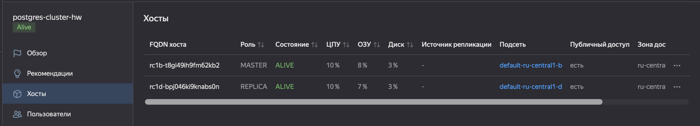
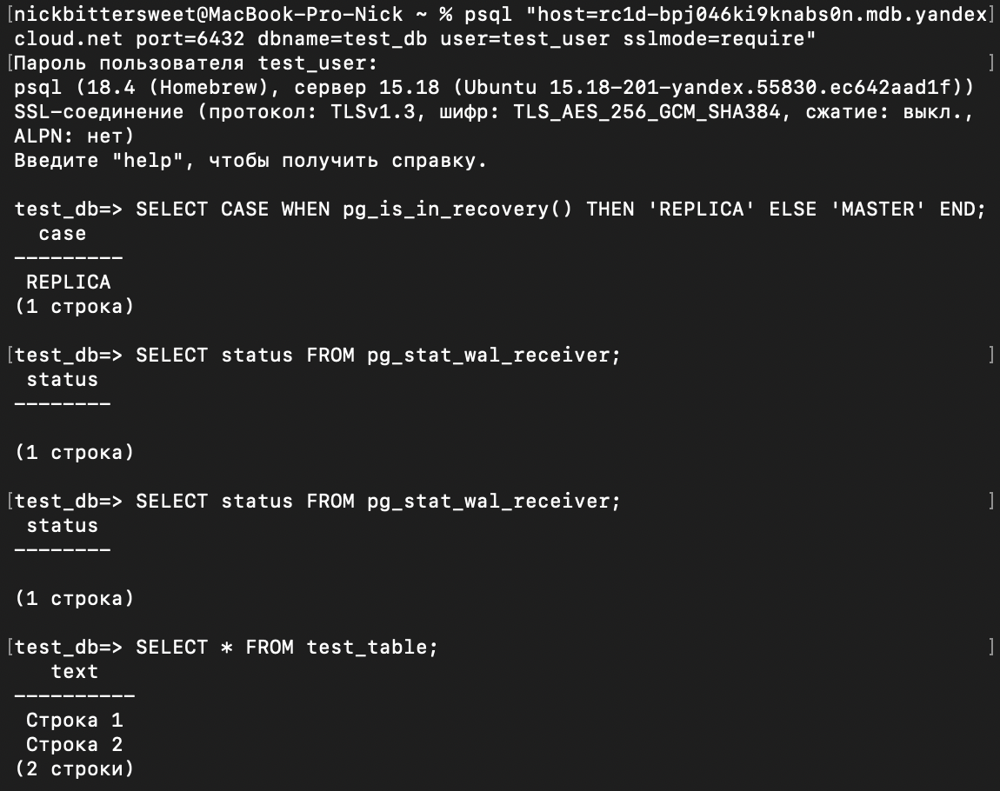

# Managed PostgreSQL in Yandex Cloud

Развертывание кластера Managed Service for PostgreSQL в Yandex Cloud с хостами в двух зонах доступности. Проверка репликации между зонами через системные функции PostgreSQL.

## Исходные данные

Кластер Managed PostgreSQL в Yandex Cloud: класс хоста `s2.micro`, диск `network-ssd`, два хоста в разных зонах доступности с публичным доступом. Подключение через `psql` с SSL-сертификатом.

Полная постановка задачи — в [task.md](task.md).

## Задача 1. Создание кластера

**Что требовалось.** Создать кластер Managed Service for PostgreSQL с двумя хостами в разных зонах доступности, с публичным доступом. Настроить учетную запись для пользователя и базы.

**Что сделано.** Кластер создан через веб-консоль Yandex Cloud со следующими параметрами:

- Класс хоста: `s2.micro`.
- Диск: `network-ssd`.
- Два хоста в зонах доступности `ru-central1-b` и `ru-central1-d`.
- Публичный доступ: включен для обоих хостов.
- Учетная запись: `test_user`, база `test_db`.

Хосты кластера после создания:



На скриншоте видно, что оба хоста в статусе `ALIVE`. Первый хост — `MASTER`, второй — `REPLICA`. Оба находятся в разных зонах доступности (`ru-central1-b` и `ru-central1-d`), что обеспечивает отказоустойчивость: при отказе одной зоны кластер продолжит работу.

## Задача 2. Подключение к мастеру и проверка репликации

**Что требовалось.** Подключиться к мастеру и реплике через `psql` с SSL-сертификатом, проверить роли узлов, создать тестовую таблицу и убедиться, что данные доехали до реплики.

**Что сделано.**

### Подключение к мастеру

Скачан SSL-сертификат из консоли кластера. Подключение через `psql` с указанием всех хостов и атрибута `target_session_attrs=read-write`:

```bash
psql "host=rc1b-xxx.mdb.yandexcloud.net,rc1d-yyy.mdb.yandexcloud.net \
      port=6432 \
      dbname=test_db \
      user=test_user \
      sslmode=require \
      target_session_attrs=read-write"
```

Атрибут `target_session_attrs=read-write` гарантирует, что подключение идет именно к мастеру, а не к реплике.

**Проверка роли узла:**

```sql
SELECT CASE WHEN pg_is_in_recovery() THEN 'REPLICA' ELSE 'MASTER' END;
```

Результат: `MASTER`. `pg_is_in_recovery()` возвращает `true` для реплик (они находятся в режиме восстановления) и `false` для мастера.

**Количество подключенных реплик:**

```sql
SELECT count(*) FROM pg_stat_replication;
```

**Создание тестовой таблицы:**

```sql
CREATE TABLE test_table(text varchar);
INSERT INTO test_table VALUES ('Строка 1'), ('Строка 2');
```

### Подключение к реплике

Из команды подключения убран атрибут `target_session_attrs`, в `host` указан только хост реплики:

```bash
psql "host=rc1d-yyy.mdb.yandexcloud.net \
      port=6432 \
      dbname=test_db \
      user=test_user \
      sslmode=require"
```

**Проверка роли узла:**

```sql
SELECT CASE WHEN pg_is_in_recovery() THEN 'REPLICA' ELSE 'MASTER' END;
```

Результат: `REPLICA`.

**Состояние репликации:**

```sql
SELECT status FROM pg_stat_wal_receiver;
```

**Проверка данных с реплики:**

```sql
SELECT * FROM test_table;
```

Результат на скриншоте:



На скриншоте видно: подключение к реплике, подтверждение роли `REPLICA`, статус `pg_stat_wal_receiver` и данные из `test_table` — те же две строки, что были созданы на мастере. Это доказывает, что репликация между зонами доступности работает.

## Что освоено

- Создание managed-кластера PostgreSQL в Yandex Cloud через консоль.
- Настройка хостов в разных зонах доступности с публичным доступом.
- Подключение к кластеру через `psql` с SSL-сертификатом.
- Работа с атрибутом `target_session_attrs=read-write` для подключения именно к мастеру.
- Системные функции PostgreSQL: `pg_is_in_recovery()`, `pg_stat_replication`, `pg_stat_wal_receiver`.
- Понимание разницы между мастером и репликой на уровне СУБД.
- Проверка работоспособности репликации через запись на мастере и чтение с реплики.

## Границы решения

- Кластер развернут вручную через веб-консоль Yandex Cloud. Автоматизация через Terraform не выполнялась (задание 2* оставлено за рамками).
- После проверки кластер удален, чтобы не тратить бюджет. Скриншоты сохранены как подтверждение работы.
- Тестовая таблица создана на мастере, но не наполнена данными сверх двух строк. Этого достаточно для проверки репликации.
- `pg_stat_wal_receiver` на реплике может показывать `status: streaming` или `stopped` в зависимости от момента проверки. На скриншоте видно актуальное состояние на момент выполнения задания.